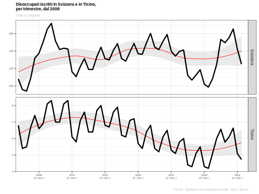
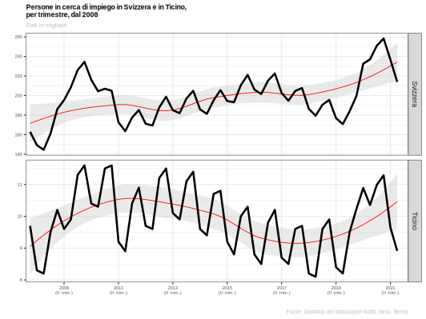
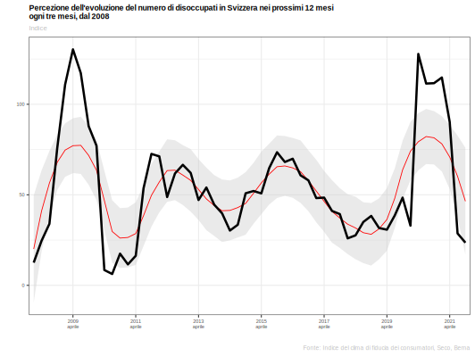

---
output:
  xaringan::moon_reader:
    css: [default, "metropolis_ustat.css", "metropolis-fonts", "specifici.css"]
    lib_dir: immagini
    nature:
      highlightStyle: github
      highlightLines: true
      countIncrementalSlides: false
      ratio: 16:9
    seal: false
    includes:
      after_body: insert-logo.html
---


```{r setup, include=FALSE}
rm(list=ls())

options(htmltools.dir.version = FALSE)

knitr::opts_chunk$set(fig.width=4.25, fig.height=3.5, fig.retina=3,
                      message=FALSE, warning=FALSE, cache = TRUE, 
                      autodep = TRUE, hiline=TRUE
                      , dev = "svg"
                      )

options(knitr.kable.NA = '')

```

class: title-slide clear


# Dati, statistica e giornalismo
## Chi è importante per chi?

<br>


### Eric Stephani, Ufficio di statistica (USTAT)
#### Dipartimento delle finanze e dell'economia
#### Sezione delle risorse

##### *Bellinzona, novembre 2021*


---
class: clear, middle

#### Statistica pubblica, dati e giornalismo

--

<br>
### ***Vademecum***

1. Il *sensibile*, dal mondo delle percezioni individuali o soggettive all'opinione

--
2. L'*intellegìbile*, dal mondo dei dati e metadati oggettivi alla conoscenza

--
3. La *statistica pubblica e il giornalismo*, con quale ruolo?  


---

# Il sensibile

##### La realtà percepita
*A vostro avviso, riferendovi alle vostre percezioni, intuizioni o esperienze*

> "[...] nei prossimi 12 mesi quale sarà l’evoluzione del numero di disoccupati in Svizzera?"

--

<br>
*Risposte:*  

.pull-left[
.font80[
- Forte diminuzione **(-2)**  
- Leggera diminuzione **(-1)**  
- Quasi nessuna variazione **(0)**

]
]

--

.pull-right[
.font80[
- Forte aumento **(+2)**  
- Leggero aumento **(+1)**  
- Non so **(0)**

]
]

---

# Dall'intellegìbile al ruolo della statistica

.pull-left[

##### Dalla trappola della realtà codificata


.font50[
.dark-warm-grey[
*“Polarised opinion landscapes and widespread misinformation have formed in an environment where emotions and beliefs prevail over facts and evidence. Something needs to be done to **regulate** the new data ecosystem, **educate** citizens and **limit** the misuse of data information”*
]
Paris21, conferenza annuale, Berna, 04.04.2018 - [[link]](https://paris21.org/about-paris21)
]
]

--

.pull-right[

##### ... alla regola delle 3C

.font80[
1. **.hl[**C**]ontrollare** .font80[.mid-warm-grey[*[Check]*]]  
È possibile il confronto tra percezione e dati? E il contrario?

2. **.hl[**C**]omprendere il senso** .font80[.mid-warm-grey[*[Understand the context]*]]  
Rispetto al contesto ha senso usare dei dati statistici

3. **Essere .hl[**c**]onsapevoli** .font80[.mid-warm-grey[*[Be aware of the source]*]]  
Si sa da dove arriva il dato e perché si usa una determinata fonte

]
]

---

# Il ruolo della statistica nel tempo

.pull-left[
###### 1850


.font70[
*"La statistica non si deve limitare a dati e fatti oggettivi, ma deve sforzarsi di mettere il cittadino in condizione di formarsi un proprio giudizio"*
]
]

--

.pull-right[
###### 2018
[
](https://tp.srgssr.ch/p/portal?urn=urn:srf:ais:video:fcca4df0-83e3-4982-aaf5-62a9b9c347c5&autoplay=true&legacy=true&width=640&height=360&playerType=)

.font70[
*Vertrauen in öffentliche Daten immer wichtiger*
].font50[.mid-warm-grey[ SRF, Tagesschau - 04 aprile 2018
]]
]

---
class: hide-logo, inverse, center, middle

# Come fidarsi della statistica


---

# Un caso pratico

.font90[
.left-column[
#### .hl[Quanti] sono i disoccupati iscritti?

]
]


.right-column[
.font40[
07 ottobre 2021,
  [www.**seco**.admin.ch](https://www.seco.admin.ch/dam/seco/it/dokumente/Publikationen_Dienstleistungen/Publikationen_Formulare/Arbeit/Arbeitslosenversicherung/Die%20Lage%20auf%20dem%20Arbeitsmarkt/arbeitsmarkt_2021/alz_09_2021.pdf.download.pdf/alz_september_2021_it.pdf) : ***"La situazione sul mercato del lavoro settembre 2021"***
]

.font60[
> "Secondo i rilevamenti effettuati dalla Segreteria di Stato dell’economia (SECO), alla fine di settembre 2021 erano **iscritti 120.294 disoccupati** presso gli uffici regionali di collocamento (URC), ossia 6.061 in meno rispetto al mese precedente. Il tasso di disoccupazione è diminuito dal 2,7% nel mese di agosto 2021 al 2,6% nel mese in rassegna. Rispetto allo stesso mese dell’anno precedente, il numero di disoccupati è diminuito di 28.266 unità (-19,0%)."

]
]

--

.right-column[
.font40[
07 ottobre 2021,
  [RG - RSI](https://www.rsi.ch/news/svizzera/La-disoccupazione-scende-ancora-14777991.html) : ***"La disoccupazione scende ancora"***
]

.font60[
> "Il tasso di disoccupazione in Svizzera ha fatto segnare un nuovo calo in settembre, stabilendosi al 2,6% contro il 2,7% di agosto. Era dal febbraio 2020, prima dell'inizio della pandemia di coronavirus, che non si registrava un tasso di disoccupazione così basso."

]
]

--

.right-column[
.font60[
<br>
Chi pubblica i dati?  ]
.font50[
  - La segreteria di Stato per l'economia .dark-warm-grey[(Seco) ], [www.**seco**.admin.ch](https://www.seco.admin.ch/seco/it/home.html)  
  - o sul sito della statistica del mercato del lavoro .dark-warm-grey[(Amstat) ], [www.**amstat**.ch](https://www.seco.admin.ch)  
  - oppure sul sito della sezione del lavoro del Canton Ticino .dark-warm-grey[(Sdl) ], [www.ti.ch/dfe/de/**sdl**/sezione](https://www4.ti.ch/dfe/de/sdl/sezione/)
]
]

--

.right-column[
.font50[
  - oppure, sul sito dell'Ufficio di statistica del Canton Ticino .dark-warm-grey[(Ustat) ], [www.ti.ch/**ustat**](https://www3.ti.ch/DFE/DR/USTAT/)  
  <!-- - sito dell'Ufficio federale di statistica .dark-warm-grey[(Ust) ], [www.**bfs**.admin.ch](https://www.bfs.admin.ch/bfs/it/home.html) -->
]
]

---
class: clear

.font90[
.left-column[
#### Quanti sono i disoccupati iscritti?
#### E in Ticino?

]
]

.img-left[]

--

<br>
.right-column[
La domanda è corretta?
]

--

.right-column[
.pull-left[
SI
]

.pull-right[
.hl[NO]
]
]

--

.right-column[
La domanda non è scorretta, ma ce n'è una .hl[più] urgente
]

---
class: clear

.font90[
.left-column[
#### Quanti sono i disoccupati iscritti?
#### **.hl[Chi]** sono i disoccupati iscritti?

<br>
.img-left[]

]
]

--

.right-column[
<br>
#### **I metadati**

.font70[
> *“I *metadati*, o *data about data* sono tutte le informazioni che permettono ai numeri di parlare di farci comprendere appieno il loro significato: glossari, classificazioni, **definizioni**, **metodologia** di indagine,...”*

]
]

--

.right-column[

#### Esempio

.font70[
.mid-warm-grey[USTAT], 03.03.02 Disoccupazione  
I *disoccupati iscritti* --> [definizione](https://www3.ti.ch/DFE/DR/USTAT/index.php?fuseaction=temi.sottotema&p1=35&p2=151&p3=156&proId=155https://www3.ti.ch/DFE/DR/USTAT/index.php?fuseaction=temi.dettaglioglossario&gloId=344&p1=35&p2=166&p3=170&proId=169)

]
]

---
class: clear

.font90[
.left-column[
#### Quanti sono i disoccupati iscritti?
#### Chi sono i disoccupati iscritti?
#### Disoccupati iscritti in Svizzera e in Ticino

]
]


.right-column[

]

---
class: clear

.font90[
.left-column[
#### Quanti sono i disoccupati iscritti?
#### Chi sono i disoccupati iscritti?
#### Disoccupati iscritti in Svizzera e in Ticino
#### Persone in cerca di impiego .hl[non] disoccupate in Svizzera e in Ticino

]
]

.right-column[


]

---
class: clear

.font90[
.left-column[
#### Quanti sono i disoccupati iscritti?
#### Chi sono i disoccupati iscritti?
#### Disoccupati iscritti in Svizzera e in Ticino
#### Persone in cerca di impiego non disoccupate in Svizzera e in Ticino
#### Persone in cerca di impiego in Svizzera e in Ticino

]
]

.right-column[


]

---
class: hide-logo, inverse, center, middle

# La trappola della realtà codificata

---

# La trappola della realtà codificata

.font60[
16 settembre 2021,
  [www.**bfs**.admin.ch: ](https://www.bfs.admin.ch/bfs/it/home/statistiche/lavoro-reddito.assetdetail.18564734.html) *"Secondo trimestre 2021: le persone occupate aumentano dello 0,5%, il tasso di disoccupazione ai sensi dell'ILO sale al 5,0% "*
]

.font70[
> "Nel secondo trimestre 2021 il numero di persone occupate in Svizzera è aumentato rispetto allo stesso trimestre dell’anno precedente (+0,5%). Le ore di lavoro settimanali effettive per persona occupata hanno segnato un forte aumento (+9,9%), tornando quasi al livello pre-pandemia. Nello stesso lasso di tempo, il tasso di disoccupazione secondo la definizione dell’Ufficio internazionale del lavoro (ILO) è aumentato dal 4,6 al 5,0% in Svizzera e dal 6,8 al 7,2% nell’UE"

]

--

.font60[
16 settembre 2021,
  [www.**cdt**.ch](https://www.cdt.ch/economia/disoccupazione-in-svizzera-piu-alta-che-in-germania-MK4639842?_sid=oxVetYDu
) *"Disoccupazione in Svizzera più alta che in Germania"*
]

.font70[
> "Rimane elevata la disoccupazione ILO in Svizzera: nel secondo trimestre il tasso si è attestato al 5,0%, contro il 5,8% registrato nei primi tre mesi dell’anno e il 4,6% dello stesso periodo del 2020. Si tratta di un valore sensibilmente superiore a quello che si osserva ad esempio in Germania e in diversi Paesi dell’Europa dell’est."

]


---
class: hide-logo, inverse, center, middle

# ~~Digitalizzazione~~, ~~automatizzazione~~, ~~*big data*~~ oppure, semplicemente, provare a .hl[**cambiare**]


---
class: middle clear
### Come cambiare e perché ha senso cambiare

.mid-warm-grey[
.font80[
Punto di partenza
]
]

--

.pull-left[
##### La cultura del pretendere
.img.left[]
.font70[
.hl[Voglio] dei dati che:
- confermino la mia tesi  
- nel caso, possa almeno dire: *tanto sono sbagliati!*
]
]

--

.pull-right[
##### .hl[vs.] la cultura dello scoprire
.img-left[]

.font70[
Applicando la *Regola delle 3C*:  
- *Confrontabile*  
- *Comprensibile*  
- *Consapevoli*

]
]

---
class: middle clear

### Risultato *ideale*

.mid-warm-grey[
.font80[
Orizzonte
]
]

--

.pull-left[
.font70[
.hl[Grazie] a una migliore conoscenza della statistica
]
##### Dalla cultura dello scoprire
.img-left[]

]

.pull-right[
.font70[
~~Cultura del pretendere~~
]
##### Alla cultura del .hl[**confronto**]
.img.left[]
]

--

.pull-right[
.font70[
[*Esempio*](
https://www4.ti.ch/fileadmin/DFE/DE-SDL/varie/disoccupazione_lettura_dati.pdf
)  
.mid-warm-grey[Origoni, Pau e Gonzalez, Oscar (2017). *"Disoccupazione: informazioni per una corretta lettura dei dati"*, Dati, statistiche e società, 1, 30-39.]

]
]

---
class: inverse, center, middle

# I vantaggi del confronto

---
class: clear

.font90[
.left-column[
#### Disoccupati ai sensi dell'ILO .hl[vs.] disoccupati iscritti
]
]


.right-column[


]

---
class: clear

.font90[
.left-column[
#### Disoccupati iscritti vs. disoccupati ai sensi dell'ILO
#### .hl[Percezione] dell'evoluzione della disoccupazione

]
]

--

.right-column[


]


---
# Riepilogo

.font80[
.pull-left[
###### Fino a questa pausa pranzo
#### Il mondo della statistica era un po' come i famosi ''30 minuti''... una regola magica

]
]

.pull-right[
.img-left[]

]

---

# Scoperta della regola delle 3C

.font80[
.left-column[
#### **PRIMA:** il mondo della statistica aveva del magico
#### **ORA:** c'è (spero) almeno un po' di curiosità
<br>
.img-left[]
]
]

--

.right-column[
###### La regola delle 3C
###### .mid-warm-grey[CUBe's rule: `*Check, understand, be aware*`]
1. .hl[**C**ontrollare], dato e percezioni sono confrontabili? E il contrario?  
.mid-warm-grey[*[**C**heck]*]  
2. .hl[**C**omprendere il senso], l'uso dei dati ha senso rispetto al contesto?  
.mid-warm-grey[*[**U**nderstand  the context]*]  
3. Essere .hl[**c**onsapevoli], sappiamo perché stiamo usando (o vorremmo usare) questa fonte di dati?  
.mid-warm-grey[*[**Be** aware of the source]*]

]

---
class: clear

.font80[
.left-column[
#### dalla cultura del pretendere
#### alla cultura del confronto

]
]


.right-column[

  

Il salto culturale, cioè passare dalla cultura del pretendere alla cultura del .hl[confronto] è qualcosa di più di un semplice *make-up*, per farlo occorre fare chiarezza su quello che sentiamo, su quello che vorremmo e poi verificare se, e come, la statistica ci può aiutare a creare un filo.  
.font60[.mid-warm-grey[*[autore sconosciuto]*]]


.font60[
<br>
<br>
Contatto:      
[eric.stephani@ti.ch](mailto:eric.stephani@ti.ch)  
<br>
.mid-warm-grey[
Slides create con R, via [**{xaringan}**](https://github.com/yihui/xaringan)
]
]
]
